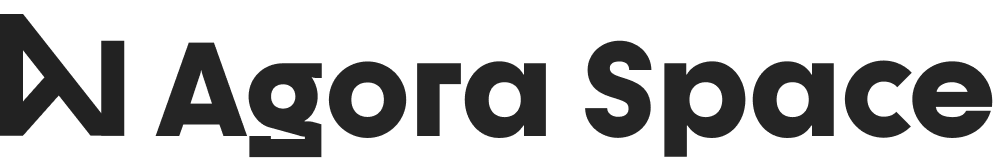

# General

**Social oracle and token utility toolkit**

A framework for all social token tools and the first use-case for social oracle networks. Social media meets blockchain in the form of a two-way integration system.  
We are building an integration layer for existing solutions, a platform to allow tokenized communities to flourish with our broad service pack. Agora Space elevates tokenized communities, helping their founders and members alike. Anyone with a tokenized community has the opportunity to give their group rich utility and they can achieve this even without any coding skills.

We are building an open economy for social money, where founders can bring their existing tokens and add rich utility to extend their functionality. Agora Space is a permissionless, social oracle layer and protocol aggregator for technologists, social entrepreneurs, and DAOs to create sustainable and rewarding ecosystems for their existing communities. This two-way social media integration to the blockchain is unifying and simplifying the rewarding and governance communities on the blockchain.

Our vision is to supercharge Web3 adoption by creating gasless, multichain, and platform-agnostic solutions, without sacrificing decentralization or privacy.

## Who is it for?

Those who want to make their community more efficient and rewarding.

Although, first and foremost DAO frameworks and crypto-related community founders. However, Agora Space’s tools individually are useful for creatives and influencers as well.

Those who are looking for a new decentralized ecosystem and are not afraid of using tokens to improve their experience.

## Our tools:

🛠**Token gated access for your committed members** with Discord, Telegram based on address history, holdings, and staked assets cross-chain. These token-gated communities create the perfect foundation for Sybil-Resistant decision-making and rewarding mechanisms.

  
🛠**Performance-based trustless financial contracts** via [Superfluid](https://www.superfluid.finance/home) integration to wrap financial agreements into programmable cash flows with real-world KPIs thanks to the Agora Space Social Oracle. These contracts are essential to a DAO2DAO future.

  
🛠**Gamification** with defining success metrics for a “season” and creating a “multiplayer experience” with the way your community works together. Add side-quests, gated content or rewards unlockable by the desired off-chain activity. A new way to reward your community, incentivize participation and cultivate community engagement and consolidate ownership. Let your members earn badges and achievements based on real social media activity.

🛠**Gasless multi-chain decision-making** via social media accounts. You can participate whether you hold tokens on mainnet or L2s in a universally verifiable way. Create feeless community votings in any token-gated Discord channel using emoji reactions or public votings with Twitter threads. Your voting power is token-weighted and gives you access to governance without using your hardware wallet all the time. This tool can create collective “meta-governance” over multiple DAOs as an option. We prioritized new and more democratic forms based on a zero-knowledge proof and a self-sovereign identity management system to maximize privacy.

## What is the vision for the rest of 2021 and more?

We are continuing development with the integration of the Agora Social Oracle layer.

Our already existing social token explorer will become “the App Store” to find tokenized communities. The vision is that we are getting more and more protocols involved while improving the governance processes on DAO frameworks with the Agora Social Oracle layer.

**Plans for 2021 include:**

* Integrating diverse projects for their own special use. [**Superfluid**](https://www.superfluid.finance/) for our trustless financial contracts and automating payments based on events outside the blockchain with the Agora Social Oracle. [**EAS**](https://eas.eth.link/) for proof of ownership, using it in our reputation and gamification-based tools and for KYCs. [**Tryroll** ](https://tryroll.com/)so we can make it even easier to issue social tokens. [**Colony.io**](https://colony.io/) for users who would like to create new DAOs. **NFT platforms** for the Agora Social Oracle layer to be able to create trustless and dynamic NFTs
* Creating an open-source toolkit from our tools to serve the developer community to allow faster growth of the space.
* Providing market-making and a decentralized marketplace for community tokens with our selected partners

We are building a space where each founder can establish their own ‘Agora’ for their communities and furnish it with Agora’s tools and collectibles.

## What is our 'triforce', our strength?

👉 Our tireless syndicate is working on establishing partnerships and integrations with existing protocols and strategic investors.

👉 We keep on expanding the swiss-knife for tokenized communities. We make sure to cater to all the needs of community founders and managers by providing a platform for marketing, analytics, tokenomics, token utilities, and market-making as well.

👉 $AGORA DAO: Members contribute to and boost their community’s treasury by staking $AGORA tokens. With this, we put an emphasis on the real 'community' feel of the whole space. Read more about the $AGORA token usage here:



