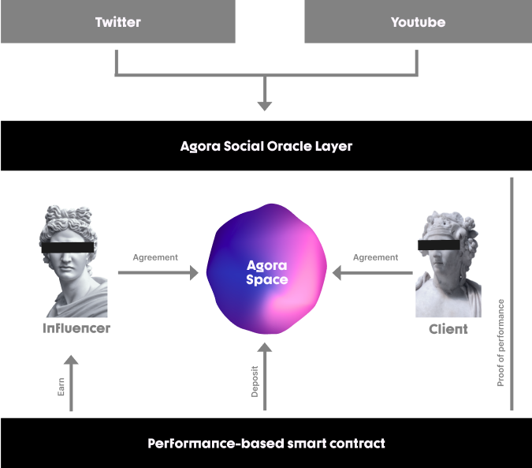

# Performance-based contract

**Performance-based creator contracts:** A new way of making trustless financial contracts based on data from social media. Participants decide on a performance indicator and a price for reaching that goal. Agora Social Oracle provides a decentralized system to make sure both parties get what they agreed to. These contracts provide a potential of a new financial solution for creatives to monetize their content without compromise.

More information coming soon...

The toolkit keeps expanding as we are establishing more and more strategic partnerships and integrate more useful protocols.   
We are also very attentive with our development to the needs of our community, the syndicate and the founders who are already using Agora Space.  

